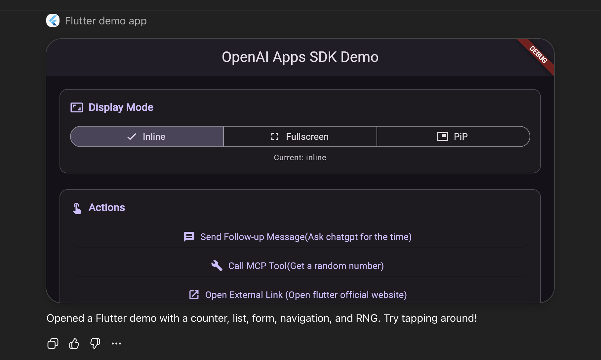
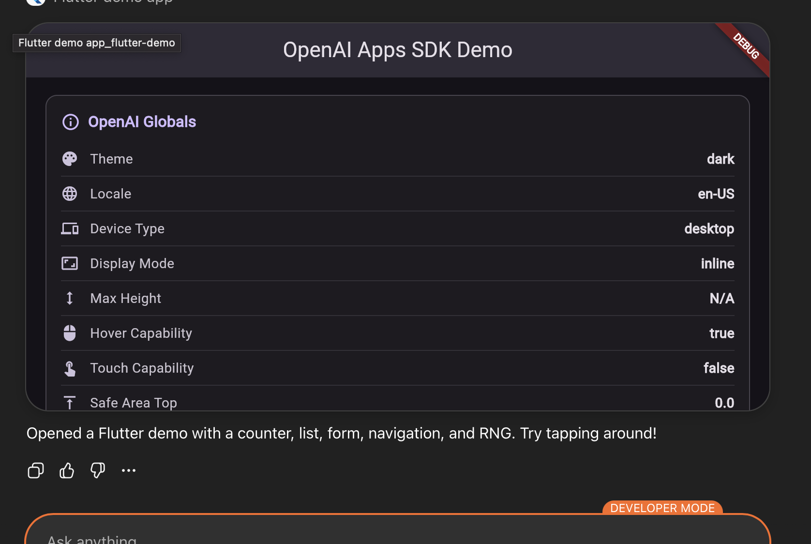
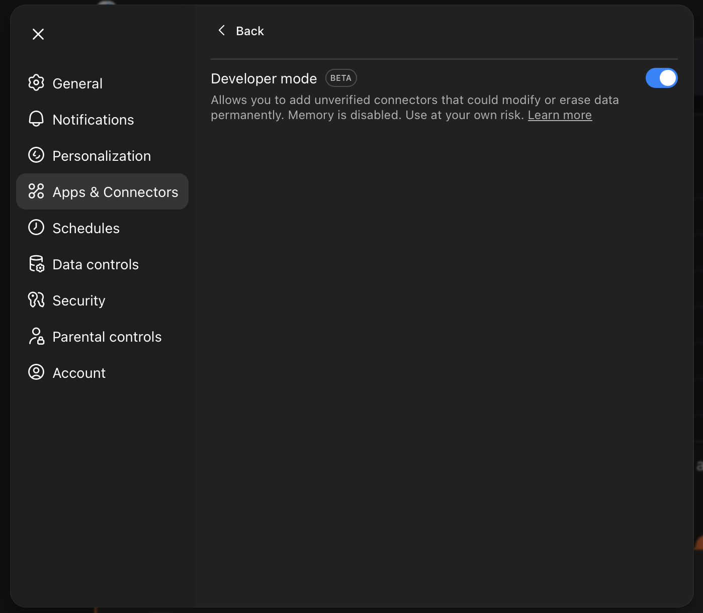
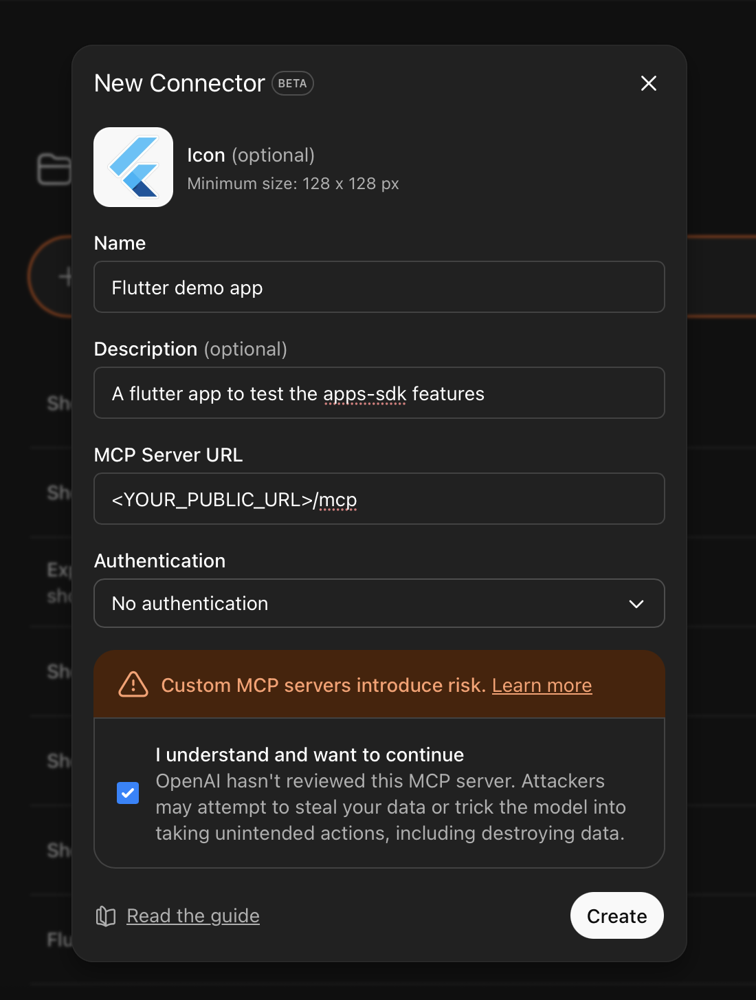
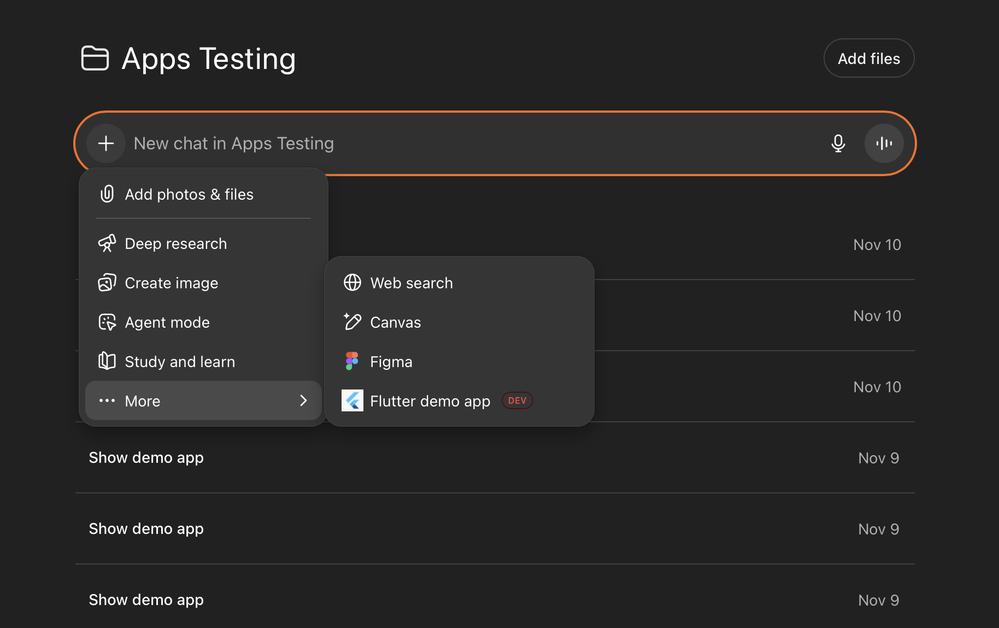

# OpenAI Apps SDK for Flutter

[![style: very good analysis][very_good_analysis_badge]][very_good_analysis_link]
[](https://github.com/felangel/mason)
[![License: BSD-3-Clause][license_badge]][license_link]

An unofficial Flutter/Dart package that provides seamless integration with OpenAI's Apps SDK for ChatGPT, enabling developers to build interactive widgets and web applications that run natively inside ChatGPT conversations.

Build rich, interactive experiences that leverage ChatGPT's AI capabilities while maintaining full access to your Flutter codebase and UI components.

## 📑 Table of Contents

- [📱 Screenshots](#-screenshots)
- [💡 Background & Motivation](#-background--motivation)
- [✨ Features](#-features)
- [🚀 Installation](#-installation)
- [📋 Prerequisites](#-prerequisites)
- [🔧 Enabling Developer Mode](#-enabling-developer-mode)
- [🌐 Connecting Your Flutter App to ChatGPT](#-connecting-your-flutter-app-to-chatgpt)
- [📚 Usage](#-usage)
  - [Getting Started](#getting-started)
  - [1. Theme Synchronization](#1-theme-synchronization)
  - [2. Display Mode Management](#2-display-mode-management)
  - [3. Configure Inline Mode Height](#3-configure-inline-mode-height-experimental)
  - [4. Call MCP Server Tools](#4-call-mcp-server-tools)
  - [5. Send Follow-up Messages](#5-send-follow-up-messages)
  - [6. Open External Links](#6-open-external-links)
  - [7. Persistent Widget State](#7-persistent-widget-state)
  - [8. Locale Detection and Localization](#8-locale-detection-and-localization)
  - [9. Safe Area Management](#9-safe-area-management)
  - [10. Device Capability Detection](#10-device-capability-detection)
  - [11. Access Tool Input Parameters](#11-access-tool-input-parameters)
  - [12. Access Tool Output and Metadata](#12-access-tool-output-and-metadata)
  - [13. Listen to Global State Changes](#13-listen-to-global-state-changes)
- [🎯 Example Application](#-example-application)
- [📖 API Reference](#-api-reference)
- [🌐 Platform Support](#-platform-support)
- [🔗 Resources](#-resources)
- [🤝 Contributing](#-contributing)
- [📄 License](#-license)
- [⚠️ Disclaimer](#-disclaimer)

## 📱 Screenshots

<p align="center">
  
  
</p>

> **Note:** Both screenshots show the app running in inline mode within ChatGPT conversations, displaying different features of the application.

## 💡 Background & Motivation

This package was created in response to OpenAI's new **Apps SDK**, which enables developers to serve applications and interactive components directly within ChatGPT conversations. 

### Why This Package Exists

OpenAI's official documentation focuses exclusively on **React applications and components**. However, this package makes the **unexpected and innovative** possible: running **Flutter applications inside ChatGPT**.

### The Flutter Advantage

While Flutter can compile to web, running a Flutter web app inside ChatGPT's Apps SDK environment is **different** from running a traditional Flutter web application:

- **🎨 Theme Integration**: Your Flutter app must dynamically adapt to ChatGPT's theme changes
- **📱 Display Modes**: Handle inline, fullscreen, and picture-in-picture modes
- **🔗 Interoperability**: Bridge between Flutter's Dart code and OpenAI's JavaScript SDK
- **💬 Conversation Context**: Your app runs within an active AI conversation, not standalone
- **🔧 MCP Integration**: Connect to Model Context Protocol servers for backend functionality

This package provides the **bridge** between Flutter's powerful UI framework and OpenAI's Apps SDK, enabling you to build rich, cross-platform Flutter applications that run natively inside ChatGPT conversations—something that wasn't officially designed but is now possible.

### What Makes This Novel

- ✨ **First of its kind**: Use Flutter (not just vanilla web components) inside ChatGPT
- 🌉 **JavaScript ↔ Dart Bridge**: Seamless interop between OpenAI's JS SDK and Flutter's Dart
- 📦 **Type-Safe API**: Converts JavaScript types to idiomatic Dart types
- 🚀 **Flutter Ecosystem**: Access to the entire Flutter widget library and pub.dev packages
- 🎯 **Developer-Friendly**: Familiar Flutter development experience with reactive streams

## ✨ Features

- 🎨 **Automatic Theme Synchronization** - Your app automatically adapts to ChatGPT's light/dark theme
- 📱 **Responsive Display Modes** - Support for inline, fullscreen, and picture-in-picture display modes
- 🌍 **Locale Detection** - Automatically detect and respond to user's language preferences
- 🔧 **MCP Tool Integration** - Call Model Context Protocol server tools from your Flutter app
- 💬 **Follow-up Messages** - Programmatically send messages to ChatGPT on behalf of the user
- 🔗 **External Navigation** - Open external URLs while keeping ChatGPT session active
- 💾 **Persistent Widget State** - Save and restore state across sessions
- 📐 **Safe Area Management** - Automatic handling of notches, status bars, and system UI
- 🖱️ **Device Capability Detection** - Detect hover and touch capabilities for optimal UX
- 📡 **Reactive Streams** - Observable streams for all global state changes

## 🚀 Installation

Add `openai_apps_sdk` to your `pubspec.yaml`:

```yaml
dependencies:
  openai_apps_sdk: ^1.0.0
```

Or install via command line:

```sh
dart pub add openai_apps_sdk
```

```sh
flutter pub add openai_apps_sdk
```

## 📋 Prerequisites

- **Dart SDK**: ^3.9.0 or higher
- **Platform**: Web only (this package is designed to run inside ChatGPT)
- **OpenAI ChatGPT Plus/Pro/Team/Enterprise**: A paid OpenAI subscription is required
- **Developer Mode**: Must be enabled in your OpenAI account settings

## 🔧 Enabling Developer Mode

To test and use applications built with this SDK, you **must enable Developer Mode** in your OpenAI account. This feature is only available with paid subscriptions.

### Requirements

- ✅ Active OpenAI subscription (Plus, Pro, Team, or Enterprise)
- ✅ Access to ChatGPT's Advanced Settings

### Setup Steps

1. **Open ChatGPT Settings**
   - Click on your profile icon in the bottom-left corner
   - Select **Settings**

2. **Navigate to Apps & Connectors**
   - In the settings menu, click on **Apps & Connectors**

3. **Access Advanced Settings**
   - Click on **Advanced settings**
   - ⚠️ **Note**: This option is only visible if you have an active paid subscription

4. **Enable Developer Mode**
   - Toggle the **Developer Mode** switch to ON

<p align="center">
  
</p>

> **Important**: Without Developer Mode enabled, your Flutter apps won't be able to run inside ChatGPT conversations.

### What Developer Mode Enables

Once activated, Developer Mode allows you to:
- 🚀 Test and run custom apps inside ChatGPT
- 🔧 Connect to Model Context Protocol (MCP) servers
- 🧪 Debug and iterate on your applications

## 🌐 Connecting Your Flutter App to ChatGPT

Once you've built your Flutter web application with this SDK, you need to connect it to ChatGPT so it can be served within conversations.

For step-by-step instructions on how to deploy and connect your app, visit the official OpenAI documentation:

📚 **[Connect to ChatGPT - Official Guide](https://developers.openai.com/apps-sdk/deploy/connect-chatgpt)**

## 📚 Usage

### Getting Started

Import the package and access the singleton instance:

```dart
import 'package:openai_apps_sdk/openai_apps_sdk.dart';

void main() {
  final sdk = OpenAiAppsSDKBridge.instance;
  
  // Your app is now connected to ChatGPT!
  print('Current theme: ${sdk.theme}');
  print('Device type: ${sdk.deviceType}');
}
```

### 1. Theme Synchronization

Automatically adapt your app's theme to match ChatGPT's current theme:

```dart
import 'package:flutter/material.dart';
import 'package:openai_apps_sdk/openai_apps_sdk.dart';

class MyApp extends StatelessWidget {
  @override
  Widget build(BuildContext context) {
    final sdk = OpenAiAppsSDKBridge.instance;
    
    return StreamBuilder<OpenAiTheme>(
      stream: sdk.themeStream,
      initialData: sdk.theme,
      builder: (context, snapshot) {
        final isDark = snapshot.data == OpenAiTheme.dark;
        
        return MaterialApp(
          theme: isDark ? ThemeData.dark() : ThemeData.light(),
          home: HomePage(),
        );
      },
    );
  }
}
```

### 2. Display Mode Management

Request and respond to display mode changes:

```dart
import 'package:openai_apps_sdk/openai_apps_sdk.dart';

// Request fullscreen mode
Future<void> enterFullscreen() async {
  final sdk = OpenAiAppsSDKBridge.instance;
  
  final grantedMode = await sdk.requestDisplayMode(
    OpenAiDisplayMode.fullscreen,
  );
  
  if (grantedMode == OpenAiDisplayMode.fullscreen) {
    print('Successfully entered fullscreen');
  } else {
    print('Fullscreen request denied, current mode: $grantedMode');
  }
}

// Listen to display mode changes
void listenToDisplayMode() {
  final sdk = OpenAiAppsSDKBridge.instance;
  
  sdk.displayModeStream.listen((mode) {
    switch (mode) {
      case OpenAiDisplayMode.inline:
        // Optimize UI for inline display (limited space)
        print('Switched to inline mode');
        break;
      case OpenAiDisplayMode.fullscreen:
        // Expand UI to use full screen
        print('Switched to fullscreen mode');
        break;
      case OpenAiDisplayMode.pip:
        // Minimize UI for picture-in-picture
        print('Switched to PiP mode');
        break;
      default:
        break;
    }
  });
}
```

### 3. Configure Inline Mode Height (Experimental)

Set custom heights for inline mode based on device type:

```dart
import 'package:openai_apps_sdk/openai_apps_sdk.dart';

void configureInlineMode() {
  final sdk = OpenAiAppsSDKBridge.instance;
  
  sdk.initInlineModeSizeConfig(
    desktopHeight: 400,
    mobileHeight: 280,
    tabletHeight: 350,
    unknownDeviceHeight: 300,
  );
}
```

### 4. Call MCP Server Tools

Invoke tools on your Model Context Protocol server:

```dart
import 'dart:convert';
import 'package:openai_apps_sdk/openai_apps_sdk.dart';

Future<void> fetchUserData() async {
  final sdk = OpenAiAppsSDKBridge.instance;
  
  try {
    final result = await sdk.callTool(
      'getUserData',
      {
        'userId': 42,
        'includeProfile': true,
      },
    );
    
    print('Result: $result');
  } catch (e) {
    print('Error calling tool: $e');
  }
}
```

### 5. Send Follow-up Messages

Programmatically send messages to ChatGPT:

```dart
import 'package:openai_apps_sdk/openai_apps_sdk.dart';

Future<void> askForMoreInfo() async {
  final sdk = OpenAiAppsSDKBridge.instance;
  
  await sdk.sendFollowUpMessage(
    'Can you provide more details about this data?',
  );
}

Future<void> guideConversation(String userSelection) async {
  final sdk = OpenAiAppsSDKBridge.instance;
  
  await sdk.sendFollowUpMessage(
    'The user selected: $userSelection. What are the next steps?',
  );
}
```

### 6. Open External Links

Navigate users to external resources:

```dart
import 'package:openai_apps_sdk/openai_apps_sdk.dart';

void openDocumentation() {
  final sdk = OpenAiAppsSDKBridge.instance;
  sdk.openExternal('https://docs.example.com/api');
}

void openSupportPage() {
  final sdk = OpenAiAppsSDKBridge.instance;
  sdk.openExternal('https://support.example.com');
}
```

### 7. Persistent Widget State

Save and restore state across sessions (widget mode only):

```dart
import 'package:openai_apps_sdk/openai_apps_sdk.dart';

// Save state
Future<void> saveState(int counter, Map<String, dynamic> preferences) async {
  final sdk = OpenAiAppsSDKBridge.instance;
  
  await sdk.setWidgetState({
    'counter': counter,
    'lastUpdated': DateTime.now().toIso8601String(),
    'preferences': preferences,
  });
}

// Restore state
void restoreState() {
  final sdk = OpenAiAppsSDKBridge.instance;
  final state = sdk.widgetState;
  
  if (state != null) {
    final counter = state['counter'] ?? 0;
    final lastUpdated = state['lastUpdated'];
    final preferences = state['preferences'] as Map<String, dynamic>? ?? {};
    
    print('Restored counter: $counter');
    print('Last updated: $lastUpdated');
  }
}
```

### 8. Locale Detection and Localization

Adapt your app to user's language preferences:

```dart
import 'package:flutter/material.dart';
import 'package:openai_apps_sdk/openai_apps_sdk.dart';

class LocalizedApp extends StatelessWidget {
  @override
  Widget build(BuildContext context) {
    final sdk = OpenAiAppsSDKBridge.instance;
    
    return StreamBuilder<String>(
      stream: sdk.localeStream,
      initialData: sdk.locale,
      builder: (context, snapshot) {
        if (!snapshot.hasData) {
          return MaterialApp(home: HomePage());
        }
        
        final locale = snapshot.data!;
        final parts = locale.split('-');
        final languageCode = parts[0];
        final countryCode = parts.length > 1 ? parts[1] : null;
        
        return MaterialApp(
          locale: Locale(languageCode, countryCode ?? ''),
          localizationsDelegates: [
            // Add your localization delegates
          ],
          supportedLocales: [
            Locale('en', 'US'),
            Locale('es', 'ES'),
            Locale('fr', 'FR'),
            // Add your supported locales
          ],
          home: HomePage(),
        );
      },
    );
  }
}
```

### 9. Safe Area Management

Handle device notches, status bars, and system UI:

```dart
import 'package:flutter/material.dart';
import 'package:openai_apps_sdk/openai_apps_sdk.dart';

class SafeAreaExample extends StatelessWidget {
  @override
  Widget build(BuildContext context) {
    final sdk = OpenAiAppsSDKBridge.instance;
    
    return StreamBuilder<OpenAiSafeArea>(
      stream: sdk.safeAreaStream,
      initialData: OpenAiSafeArea(insets: sdk.safeAreaInsets),
      builder: (context, snapshot) {
        if (!snapshot.hasData) return YourContent();
        
        final insets = snapshot.data!.insets;
        
        return Padding(
          padding: EdgeInsets.only(
            top: insets.top,
            bottom: insets.bottom,
            left: insets.left,
            right: insets.right,
          ),
          child: YourContent(),
        );
      },
    );
  }
}
```

### 10. Device Capability Detection

Optimize UX based on device capabilities:

```dart
import 'package:flutter/material.dart';
import 'package:openai_apps_sdk/openai_apps_sdk.dart';

class AdaptiveButton extends StatelessWidget {
  final VoidCallback onPressed;
  final String label;
  
  const AdaptiveButton({
    required this.onPressed,
    required this.label,
  });
  
  @override
  Widget build(BuildContext context) {
    final sdk = OpenAiAppsSDKBridge.instance;
    
    // Check device capabilities
    final hasHover = sdk.hasHoverCapability;
    final hasTouch = sdk.hasTouchCapability;
    final deviceType = sdk.deviceType;
    
    return ElevatedButton(
      onPressed: onPressed,
      style: ElevatedButton.styleFrom(
        // Increase touch target size for touch devices
        minimumSize: hasTouch ? Size(48, 48) : Size(36, 36),
      ),
      child: hasHover
          ? Tooltip(
              message: 'Click to $label',
              child: Text(label),
            )
          : Text(label),
    );
  }
}

// Device-specific layout
Widget buildAdaptiveLayout() {
  final sdk = OpenAiAppsSDKBridge.instance;
  
  switch (sdk.deviceType) {
    case OpenAiDeviceType.mobile:
      return MobileLayout();
    case OpenAiDeviceType.tablet:
      return TabletLayout();
    case OpenAiDeviceType.desktop:
      return DesktopLayout();
    default:
      return ResponsiveLayout();
  }
}
```

### 11. Access Tool Input Parameters

Retrieve the parameters passed when your tool was invoked:

```dart
import 'package:openai_apps_sdk/openai_apps_sdk.dart';

void handleToolInput() {
  final sdk = OpenAiAppsSDKBridge.instance;
  final input = sdk.toolInput;
  
  final userId = input['userId'] as int?;
  final options = input['options'] as Map<String, dynamic>?;
  
  print('Tool invoked with:');
  print('  User ID: $userId');
  print('  Options: $options');
}
```

### 12. Access Tool Output and Metadata

Retrieve the output and metadata from the MCP tool that triggered your app:

```dart
import 'package:openai_apps_sdk/openai_apps_sdk.dart';

void handleToolData() {
  final sdk = OpenAiAppsSDKBridge.instance;
  
  // Access tool output
  final output = sdk.toolOutput;
  if (output != null) {
    final result = output['result'];
    final data = output['data'] as Map<String, dynamic>?;
    print('Tool output: $result');
    print('Data: $data');
  }
  
  // Access tool execution metadata
  final metadata = sdk.toolResponseMetadata;
  if (metadata != null) {
    final executionTime = metadata['executionTime'];
    final status = metadata['status'];
    print('Execution time: $executionTime ms');
    print('Status: $status');
  }
}
```

### 13. Listen to Global State Changes

Monitor all global state changes with a single stream:

```dart
import 'package:openai_apps_sdk/openai_apps_sdk.dart';

void monitorGlobalChanges() {
  final sdk = OpenAiAppsSDKBridge.instance;
  
  sdk.globalsStream.listen((globals) {
    if (globals.theme != null) {
      print('Theme changed to: ${globals.theme}');
    }
    if (globals.displayMode != null) {
      print('Display mode changed to: ${globals.displayMode}');
    }
    if (globals.maxHeight != null) {
      print('Max height changed to: ${globals.maxHeight}');
    }
    if (globals.locale != null) {
      print('Locale changed to: ${globals.locale}');
    }
    if (globals.safeArea != null) {
      print('Safe area changed: ${globals.safeArea}');
    }
  });
}
```

## 🎯 Example Application

A complete example application demonstrating all the features of this package is available in the `example` folder.

### Running the Example

Testing Flutter apps inside ChatGPT requires a different setup than traditional Flutter web apps. Follow these steps carefully:

#### Prerequisites

- **Node.js**: Required to run the MCP server
- **ngrok** or **Cloudflared**: To expose your localhost to the public internet
- **Developer Mode**: Must be enabled in ChatGPT (see [Enabling Developer Mode](#🔧-enabling-developer-mode))

#### Step 1: Build the Flutter App

First, build your Flutter web application:

1. Navigate to the example directory:
```sh
cd example
```

2. Build the Flutter app for web:
```sh
flutter build web
```

This will generate the web build in the `example/build/web` directory. The important files generated are:
- **`main.dart.js`**: The compiled Dart code
- **`assets/`**: All app assets (images, fonts, etc.)

These files will be served by the MCP server. To see how the MCP server uses these files, check [`mcp_example/src/server.ts`](./mcp_example/src/server.ts).

#### Step 2: Expose Your Localhost

Expose your local server (port 8000) to the public internet using one of these tools:

**Option A: Using ngrok**
```sh
ngrok http 8000
```

**Option B: Using Cloudflared**
```sh
cloudflared tunnel --url http://localhost:8000
```

Copy the public URL provided (e.g., `https://abc123.ngrok.io`).

#### Step 3: Configure the MCP Server

1. Navigate to the MCP example directory:
```sh
cd mcp_example
```

2. Create a `.env` file with your configuration:
```env
PORT=8000
CDN_URL=<YOUR_PUBLIC_URL>/
```

Replace `<YOUR_PUBLIC_URL>` with the URL from ngrok or Cloudflared.

#### Step 4: Install Dependencies and Run MCP Server

1. Install Node.js dependencies:
```sh
npm install
```

2. Start the MCP server:
```sh
npm run dev
```

The server should now be running on port 8000 and accessible via your public URL.

#### Step 5: Connect MCP to ChatGPT

1. Open ChatGPT and go to **Settings**
2. Navigate to **Apps & Connectors**
3. Click **Create** to add a new connection
4. Fill in the form:
   - **App Name**: Your app name
   - **MCP URL**: Your public URL from Step 1
   - **Icon/Image**: Upload an icon (optional)
   - **Other fields**: As explained in the [official documentation](https://developers.openai.com/apps-sdk/deploy/connect-chatgpt)

<p align="center">
  
</p>

#### Step 6: Test Your App in ChatGPT

1. **Ensure Developer Mode is enabled** (see requirements above)

2. In the ChatGPT interface, click the **"+" (More)** button at the bottom

3. Search for and select your app from the list

<p align="center">
  
</p>

4. Send a prompt to activate your app:
```
show me the demo app
```

Your Flutter app should now appear inside the ChatGPT conversation! 🎉

### What the Example Demonstrates

The example app showcases:
- ✅ Theme synchronization with ChatGPT
- ✅ Display mode management (inline, fullscreen, PiP)
- ✅ Locale detection and localization
- ✅ Safe area handling
- ✅ Device capability detection
- ✅ MCP tool integration
- ✅ Widget state persistence

For more details, check out the [example application](./example).

## 📖 API Reference

### Core Methods

| Method | Description | Returns |
|--------|-------------|---------|
| `callTool(name, args)` | Invoke a tool on your MCP server | `Future<String>` |
| `sendFollowUpMessage(prompt)` | Send a message to ChatGPT | `Future<void>` |
| `openExternal(href)` | Open an external URL | `void` |
| `requestDisplayMode(mode)` | Request a display mode change | `Future<OpenAiDisplayMode>` |
| `setWidgetState(state)` | Update persistent widget state | `Future<void>` |
| `initInlineModeSizeConfig()` | Configure inline mode height | `void` |

### Reactive Streams

| Stream | Description | Type |
|--------|-------------|------|
| `globalsStream` | All global state changes | `Stream<PartialOpenAiGlobals>` |
| `themeStream` | Theme changes | `Stream<OpenAiTheme>` |
| `displayModeStream` | Display mode changes | `Stream<OpenAiDisplayMode>` |
| `safeAreaStream` | Safe area inset changes | `Stream<OpenAiSafeArea>` |
| `localeStream` | Locale changes | `Stream<String>` |

### Global State Getters

| Getter | Description | Type |
|--------|-------------|------|
| `theme` | Current ChatGPT theme | `OpenAiTheme` |
| `locale` | User's locale | `String?` |
| `maxHeight` | Maximum available height | `double?` |
| `displayMode` | Current display mode | `OpenAiDisplayMode` |
| `deviceType` | Device type | `OpenAiDeviceType?` |
| `hasHoverCapability` | Supports hover | `bool` |
| `hasTouchCapability` | Supports touch | `bool` |
| `safeAreaInsets` | Safe area insets | `OpenAiSafeAreaInsets` |
| `toolInput` | Tool input parameters | `Map<String, dynamic>` |
| `toolOutput` | Tool output result | `Map<String, dynamic>?` |
| `toolResponseMetadata` | Tool execution metadata | `Map<String, dynamic>?` |
| `widgetState` | Persistent widget state | `Map<String, dynamic>?` |

### Enums

#### OpenAiTheme
- `light` - Light theme
- `dark` - Dark theme
- `unknown` - Unknown theme

#### OpenAiDisplayMode
- `inline` - Inline display (within conversation)
- `fullscreen` - Fullscreen display
- `pip` - Picture-in-picture display
- `unknown` - Unknown display mode

#### OpenAiDeviceType
- `mobile` - Mobile phone
- `tablet` - Tablet device
- `desktop` - Desktop computer
- `unknown` - Unknown device type

## 🌐 Platform Support

| Platform | Supported |
|----------|-----------|
| Web | ✅ |
| Android | ❌ |
| iOS | ❌ |
| macOS | ❌ |
| Windows | ❌ |
| Linux | ❌ |

**Note:** This package is specifically designed to run inside ChatGPT's web environment and requires the OpenAI Apps SDK to be available.

## 🔗 Resources

- [OpenAI Apps SDK Official Documentation](https://platform.openai.com/docs/apps)
- [Example Project](./example)
- [API Reference](https://pub.dev/documentation/openai_apps_sdk/latest/)
- [Issue Tracker](https://github.com/yourusername/openai_apps_sdk/issues)

## 🤝 Contributing

Contributions are welcome! Please read our [contributing guidelines](CONTRIBUTING.md) before submitting pull requests.

### Development Setup

1. Clone the repository:
```sh
git clone https://github.com/yourusername/openai_apps_sdk.git
cd openai_apps_sdk
```

2. Install dependencies:
```sh
dart pub get
```

3. Check code quality:
```sh
dart analyze
dart format .
```

## 📄 License

This project is licensed under the BSD 3-Clause License - see the [LICENSE](LICENSE) file for details.

## ⚠️ Disclaimer

This is an **unofficial** package and is not affiliated with, maintained, authorized, endorsed, or sponsored by OpenAI.

---

Made with ❤️ for the Flutter community

[dart_install_link]: https://dart.dev/get-dart
[github_actions_link]: https://docs.github.com/en/actions/learn-github-actions
[license_badge]: https://img.shields.io/badge/license-BSD--3--Clause-blue.svg
[license_link]: https://opensource.org/licenses/BSD-3-Clause
[very_good_analysis_badge]: https://img.shields.io/badge/style-very_good_analysis-B22C89.svg
[very_good_analysis_link]: https://pub.dev/packages/very_good_analysis
[very_good_coverage_link]: https://github.com/marketplace/actions/very-good-coverage
[very_good_workflows_link]: https://github.com/VeryGoodOpenSource/very_good_workflows
